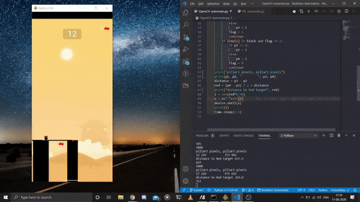

# StickHero-Automate
The Python Script uses OpenCV and ADB(Android Debugging Bridge) this allows the script to capture screenshots and also send commands to the phone over usb.

Screenshot are processed by OpenCV to find the end points of the pillar with pixel perfect accuracy this length is then used to calculate the time to hold the screen
for the to make the bridge. The distance between the pillar and the time duration of the hold were figure out by trial and error and the relation is simply to hold 
screen as unit length of the distance but in milliseconds.

The game on the screen is mirrored over wifi from the mobile.

## What's Ahead:

> The time taken between each turn is nearly 3 seconds and that is due to limitation of the screen capture over ADB

> The logic can be altered to make this suitable for other game automation too. The OpenCV and control logic only needs to change and this can be used as a proof of concept
