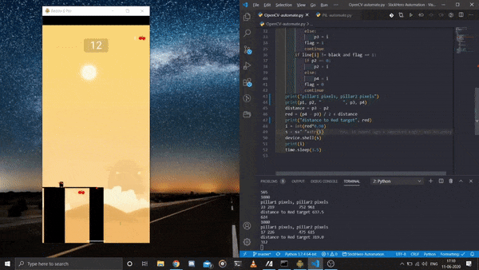

# Stick Hero — Automate 🎮

A small computer-vision bot that plays the mobile game **Stick Hero** for you, using OpenCV for pixel-perfect measurement and ADB (Android Debug Bridge) to drive the phone directly over USB/Wi-Fi — no root or game-memory hacking involved.



## How it works

1. **Capture** — `device.screencap()` grabs a screenshot of the mirrored phone screen over ADB.
2. **Measure** — a single horizontal scan-line of the screenshot is thresholded against black to find the pillar edges with pixel-perfect accuracy, giving the exact gap distance between the current and next pillar.
3. **Act** — that pixel distance is mapped 1:1 to a hold duration in milliseconds (found empirically by trial and error: *hold time ≈ distance*), and an `input touchscreen swipe` ADB command holds the screen for exactly that long so the stick grows to the right length and the character crosses safely.
4. Repeat, forever (or until you lose 😄).

## Requirements

- Python 3
- [`pure-python-adb`](https://pypi.org/project/pure-python-adb/) (`pip install pure-python-adb`)
- OpenCV (`pip install opencv-python`)
- Android device with **USB debugging** enabled, connected via `adb`, with the game screen mirrored to the desktop

```bash
pip install -r requirements.txt
adb start-server            # make sure your device shows up in `adb devices`
python OpenCV-automate.py
```

## What's ahead

> The time taken between each turn is nearly 3 seconds, due to the limitation of screen capture over ADB.

> The logic can be adapted to automate other similar games — only the OpenCV measurement and control logic need to change, so this repo can serve as a proof of concept for that class of timing-based mobile games.
